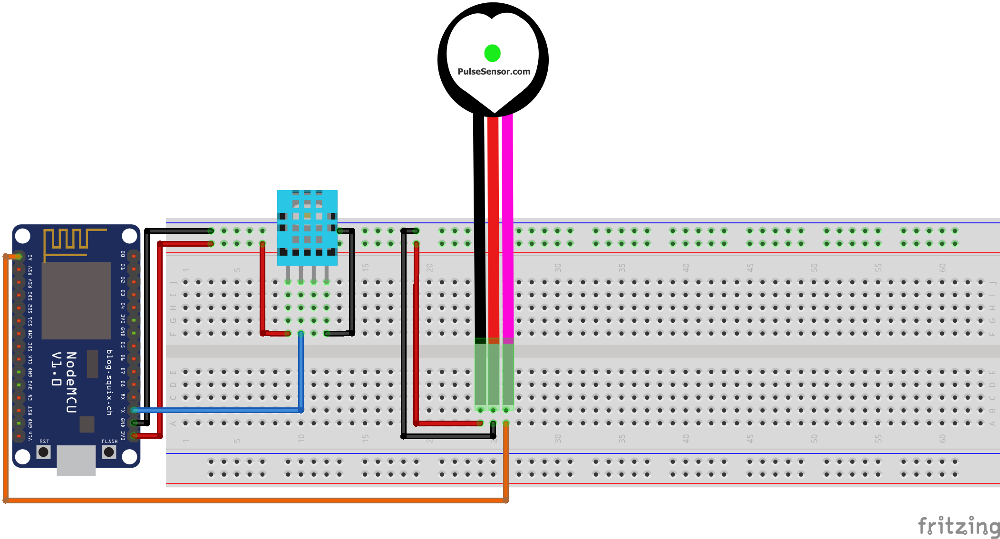
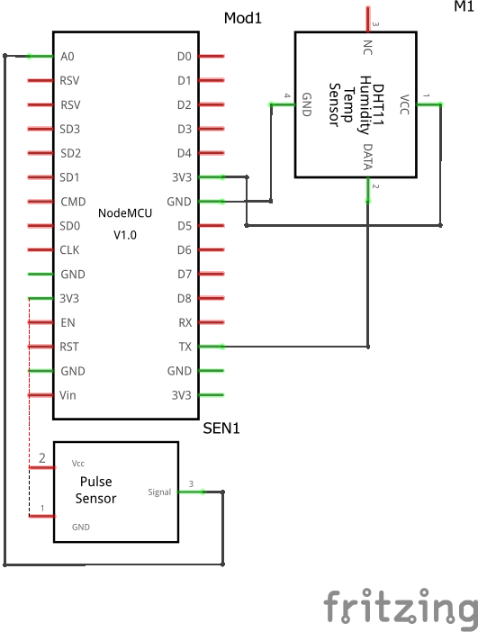

# :thermometer: #Climei
O Climei é um aplicativo desenvolvido por nós da Technoware Solutions com o propósito de zelar pela saúde das pessoas em face das variáveis climáticas. Reconhecendo o impacto significativo do clima na saúde, o Climei oferece uma gama de funcionalidades para auxiliar os usuários a se protegerem dos efeitos adversos. Como por exemplo: em dias de calor intenso, onde a desidratação e o esgotamento por calor são preocupações, o aplicativo fornece orientações personalizadas, ou seja, recomendações como a ingestão de até 2 litros de água, permanecer em ambientes frescos, vestir roupas leves e evitar exercícios físicos intensos são adaptadas de acordo com as condições climáticas e as características individuais do usuário. Além disso, o Climei vai além, oferecendo alertas sobre a possibilidade de ondas de calor, conselhos específicos para quem lida com condições crônicas como diabetes ou asma, e sugestões de atividades físicas apropriadas para o clima do momento.
 
A tecnologia por trás do Climei é impulsionada por sensores de Internet das Coisas (IoT), que monitoram em tempo real dados como temperatura, umidade, batimentos cardíacos e níveis de oxigenação no sangue. Essa coleta precisa de informações permite que o aplicativo forneça insights ainda mais refinados e personalizados. Por exemplo, ao utilizar os dados de temperatura e umidade, o Climei pode calcular a taxa de transpiração do usuário, fornecendo orientações específicas sobre a quantidade de água necessária para evitar a desidratação.

## :file_folder: Conteúdo
- [:thermometer: #Climei](#thermometer-climei)
  - [:file\_folder: Conteúdo](#file_folder-conteúdo)
  - [:books: Bibliotecas necessárias (Node-RED)](#books-bibliotecas-necessárias-node-red)
  - [:books: Bibliotecas necessárias (ESP8266)](#books-bibliotecas-necessárias-esp8266)
  - [:computer: Esquemas Eletrônicos](#computer-esquemas-eletrônicos)

## :books: Bibliotecas necessárias (Node-RED)
- [node-red](https://flows.nodered.org/node/node-red)
- [node-red-dashboard](https://flows.nodered.org/node/node-red-dashboard)
- [node-red-contrib-moment](https://flows.nodered.org/node/node-red-contrib-moment)

## :books: Bibliotecas necessárias (ESP8266)

- [ArduinoJson](https://arduinojson.org/)
- [DHTesp](#)
- [PulseSensorPlayground](#)
- [PubSubClient](#)
- [Wire](#)
- [ESP8266WiFi](#)

## :computer: Esquemas Eletrônicos

